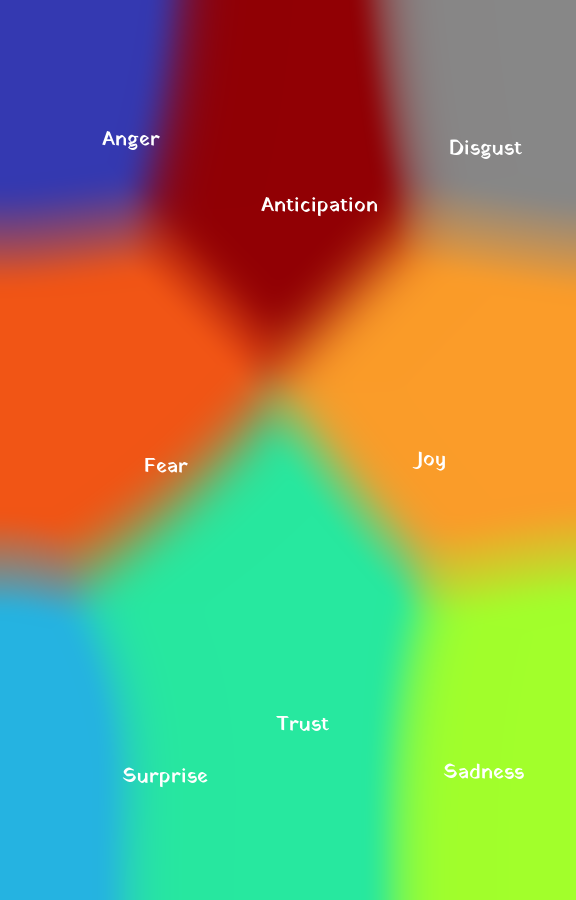

# VoronoiHeatmap

## **About:**

Trying to create a program to replicate the “aura portrait” from *“Reading the Auras of Democrats and Republicans on the Eve of the Election”* in the [NY Times](https://www.nytimes.com/2024/11/04/opinion/democrat-republican-election-vibes.html). Specifically this is intended to represent sentiment data from NLP.

### Method

Using the {WeightedTreemap} package to build a voronoi treemap with area calculations that match the relative size of each emotion from the NLP analysis. The location of the nodes is mapped and carried forward to label following image processing with {magick} package.

### To do:

-   Change the label fonts

-   Clarify the positioning of the labels following the scaling between steps.

-   Add the weighting back in as text annotation.

-   Confirm the color choices.
